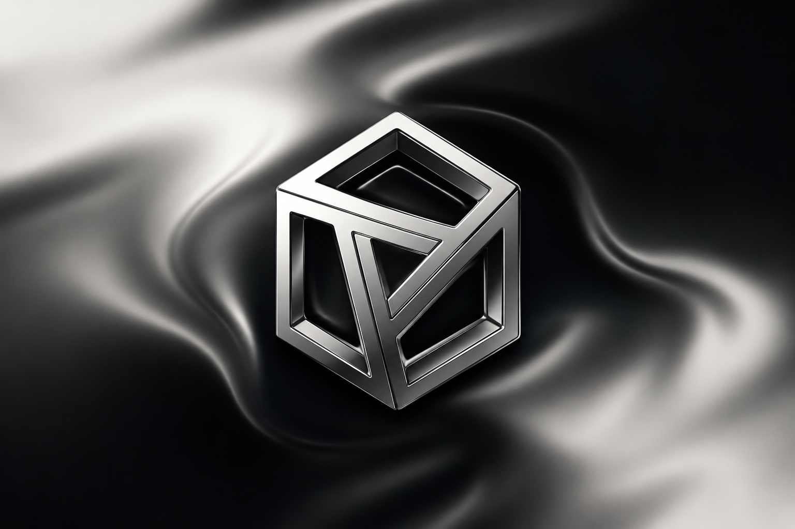

# uiception

A set of pre-built UI blocks for Next.js that you can customize, extend, and build on. Hero sections, navbars, pricing tables, CTAs, and more. Start from complete sections. Just make it yours.

## Documentation

Visit https://uiception.com/docs to view the documentation.

## Contributing

Please read the [contributing guide](/CONTRIBUTING.md).

## License

Licensed under the [MIT license](./LICENSE).
